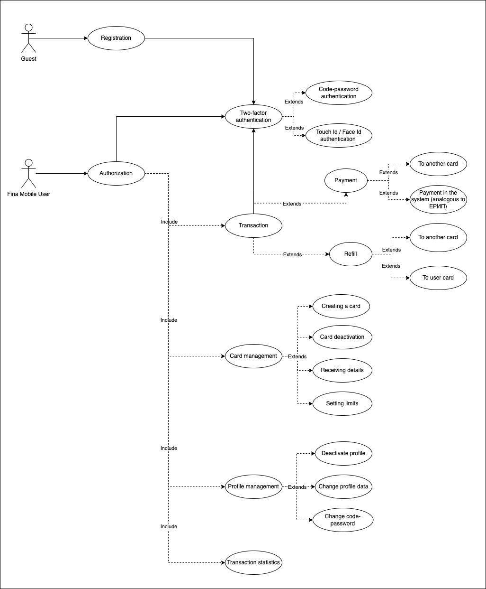

# Fina Mobile banking app
Fast, secure, simple mobile banking. Nothing extra, just transactions, cards and statistics.

## Research

### Problem: 
Managing finances and banking can be a tedious and inconvenient process for many people. It's especially difficult to keep track of your budget, control expenses, and make instant transfers without knowing exactly how much money you have in your account. Also, many users would like to receive additional bonuses and cashback for their financial transactions, but often do not have information about the available offers.

### Solution: 
"Fina mobile" addresses a number of financial problems and satisfies the needs of users:
1. Financial Management: The app allows users to easily track their income and expenses. It automatically categorizes transactions, provides statistics and graphs for a better understanding of your financial health.
2. Budget Control: Users can set limits on their virtual cards and receive notifications when they are close to exceeding the limit. This helps to avoid unexpected overspending and disciplines the management of funds.
3. Bonuses and cashback: The application provides information about available offers and bonuses associated with the use of virtual cards. This allows users to save money and earn rewards for their financial transactions.
4. Instant transfers: Users can make instant transfers to other people without commission. This simplifies the money transfer process and makes it fast and convenient.
5. Collection of statistics: The application collects statistics about the user's expenses and income, which helps them better understand where money is going and coming from. This can help you create a more effective financial plan.

Thus, this mobile application solves problems related to financial management, budget control, receiving bonuses and cashback, and also facilitates the process of instant money transfers, providing users with all the necessary information about the status and management of their finances.

---

## Requirements
* Registration by phone number and password
* Authorization by phone number and password
* Account is linked to the passport number
* Two-factor authentication for transactions (code-password, touch id, face id)
* Creation and management of virtual cards
* Setting limits on payments and transfers
* Payment history storage and statistics
* Account Management
* Topping up card accounts
* Transfers between cards and cashback

---

## Use Case Diagram:

---